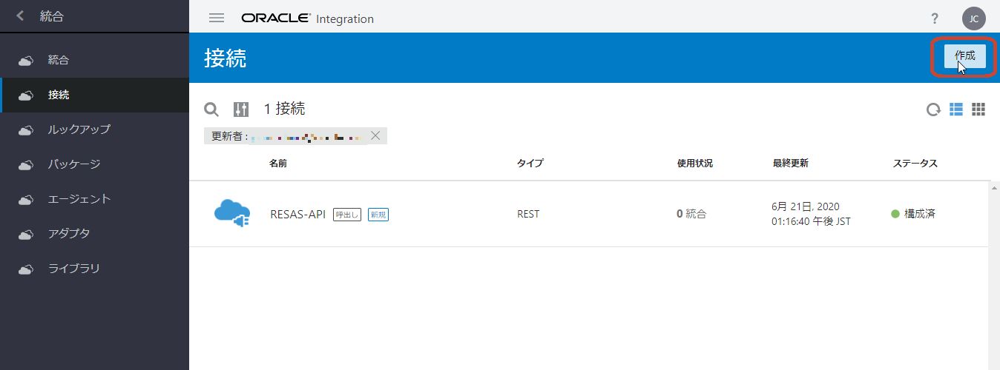
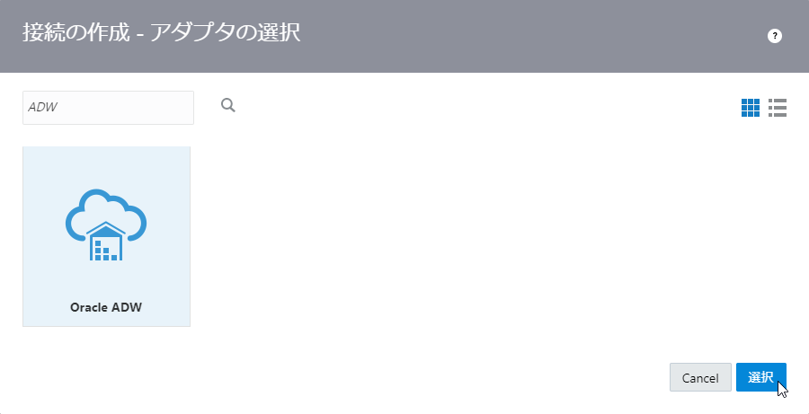
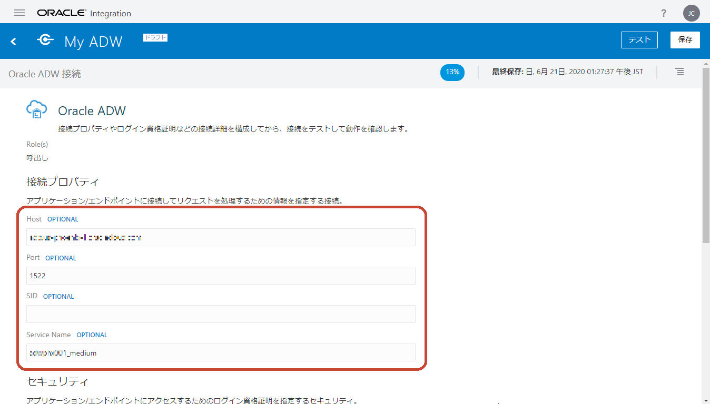
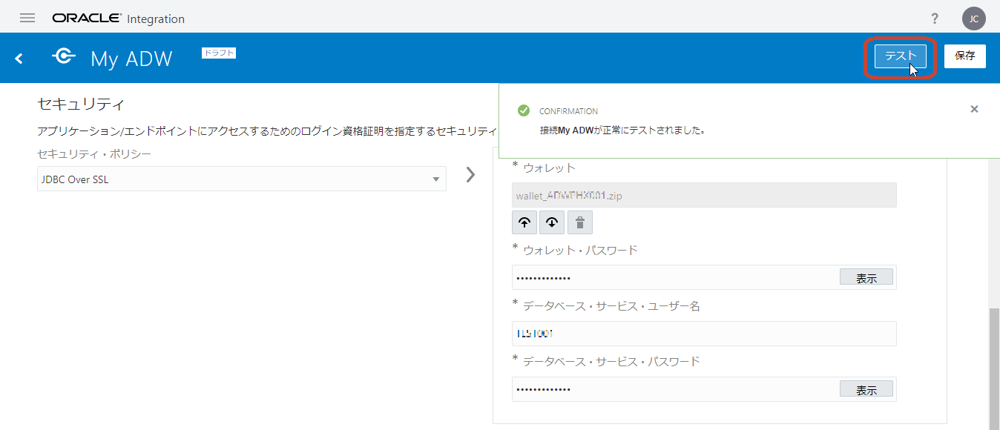
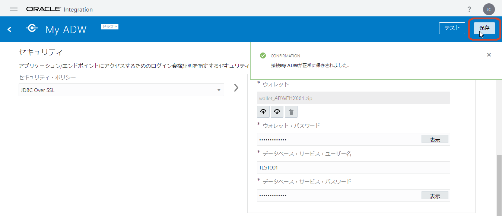

# Oracle ADW アダプタを使用した接続の作成

## Oracle ADW のウォレット・ファイルのダウンロード

Oracle ADW のデータベースにアクセスするには、ウォレット・ファイルが必要になります。
ウォレット・ファイルをダウンロードする手順は次のとおりです。

1.  OCI コンソールにログインします。
    ページの左側にあるナビゲーション・メニューから **「データベース」** セクションの **「Autonomous Data Warehouse」** を選択します。

1.  使用する ADW インスタンスが作成された **「リージョン」** と **「コンパートメント」** を選択します。
    使用する ADW インスタンスの表示名をクリックして詳細ページを開きます。
    **「DB接続」** ボタンをクリックします。

1.  **「DB接続」** ボックスが表示されます。
    **「ウォレット・タイプ」** では **「インスタンス・ウォレット」** を選択して、 **「ウォレットのダウンロード」** ボタンをクリックします。

1.  **「ウォレットのダウンロード」** ボックスが表示されます。
    ウォレットのパスワードを指定する必要があります。
    **「パスワード」** と **「パスワードの確認」** にパスワードを指定します。
    ここで指定したパスワードは、 Oracle Integration Cloud で接続を作成する際に必要なので、忘れないようにしてください。

    **「ダウンロード」** ボタンをクリックすると、ウォレット・ファイル `wallet_<DB名>.zip` がダウンロードされます。

1.  ダウンロードしたウォレット・ファイル `wallet_<DB名>.zip` に含まれているファイル `tnsnames.ora` を任意のテキスト・エディタで開き、接続に必要なホスト名とサービス名を確認します。
    `tnsnames.ora` には次のような3つのエントリが記述されています（改行を追加しています）。

    ```txt
    <DB名>_high = (description=
        (retry_count=20)
        (retry_delay=3)
        (address=(protocol=tcps)(port=1522)(host=xxx.yyy.oraclecloud.com))
        (connect_data=(service_name=zzzzz_<DB名>_high.adwc.oraclecloud.com))
        (security=(ssl_server_cert_dn="CN=adwc.uscom-east-1.oraclecloud.com,OU=Oracle BMCS US,O=Oracle Corporation,L=Redwood City,ST=California,C=US")))

    <DB名>_low = (description=
        (retry_count=20)
        (retry_delay=3)
        (address=(protocol=tcps)(port=1522)(host=xxx.yyy.oraclecloud.com))
        (connect_data=(service_name=zzzzz_<DB名>_low.adwc.oraclecloud.com))
        (security=(ssl_server_cert_dn="CN=adwc.uscom-east-1.oraclecloud.com,OU=Oracle BMCS US,O=Oracle Corporation,L=Redwood City,ST=California,C=US")))

    <DB名>_medium = (description=
        (retry_count=20)
        (retry_delay=3)
        (address=(protocol=tcps)(port=1522)(host=xxx.yyy.oraclecloud.com))
        (connect_data=(service_name=zzzzz_<DB名>_medium.adwc.oraclecloud.com))
        (security=(ssl_server_cert_dn="CN=adwc.uscom-east-1.oraclecloud.com,OU=Oracle BMCS US,O=Oracle Corporation,L=Redwood City,ST=California,C=US")))
    ```

    ホスト名は、 各エントリ内の `(address=(protocol=tcps)(port=1522)(host=xxx.yyy.oraclecloud.com))` で指定されている `host` の値です。
    この例では、 `xxx.yyy.oraclecloud.com` です
    （`xxx.yyy` の部分は、使用するウォレット・ファイル内の `tnsnames.ora` に記述されているものと置き換えてください）。

    サービス名は、次の3つのうちのどれか1つを選択できます:
    - `<DB名>_high`
    - `<DB名>_low`
    - `<DB名>_medium`

    今回は、 `<DB名>_medium` を使用することにします。
    （`<DB名>` は、使用するウォレット・ファイル内の `tnsnames.ora` に記述されているものと置き換えてください）

## Oracle Integration Cloud で接続を作成

ウォレット・ファイルをダウンロードし、接続情報を確認できたら、 Oracle Integration Cloud で ADW アダプタを使用した接続を作成します。
接続を作成する手順は次のとおりです。

1.  Oralce Integration Cloud にログインし、 **「接続」** ページを開きます。
    **「接続」** ページの右上にある **「作成」** ボタンをクリックします。

    

1.  **「接続の作成 - アダプタの選択」** ボックスが表示されたら、 **「検索」** フィールドに `ADW` と入力して、表示を絞り込みます。

    

    表示された **「Oracle ADW」** アイコンをクリックしてから右下の **「選択」** ボタンをクリックします。

1.  **「接続の作成」** ボックスが表示されます。
    作成する接続の基本情報を入力します。

    | 入力項目 | 入力する値 |
    |:----|:----|
    | **「名前」** | My ADW |
    | **「識別子」** | MY_ADW |
    | **「ロール」** | **「呼び出し」** を選択 |

    

    入力したら右下の **「作成」** ボタンをクリックします。

1.  接続の詳細を入力するページが表示されます。
    **「接続プロパティ」** セクションでは、次のように値を入力します。

    | 入力項目 | 入力する値 |
    |:----|:----|
    | **「Host」** | ウォレット・ファイル内の `tnsnames.ora` から取得したホスト名 |
    | **「Port」** | 1522 |
    | **「SID」** | 入力しない |
    | **「Service Name」** | `<DB名>_medium` （`<DB名>` は、使用する環境のものと置き換えてください） |

    

1.  **「セキュリティ」** セクションでは、次のように値を入力します。

    | 入力項目 | 入力する値 |
    |:----|:----|
    | **「セキュリティ・ポリシー」** | **「JDBC Over SSL」** を選択 |
    | **「ウォレット」** |  （アップロード）ボタンをクリックして、ウォレット・ファイル `wallet_<DB名>.zip` をアップロード |
    | **「ウォレット・パスワード」** | ウォレット・ファイルをダウンロードする際に指定したパスワードを入力 |
    | **「データベース・サービス・ユーザー名」** | ADW インスタンスのユーザー名を入力 |
    | **「パスワード」** | ADW インスタンスのユーザーのパスワードを入力 |

    

1.  **「接続プロパティ」** と **「セキュリティ」** の値を入力したら、ページの右上に表示されている **「テスト」** ボタンをクリックします。

    

    接続のテストに成功すると、 **「接続 *<接続名>* が正常にテストされました。」** というメッセージがページの右上に表示されます。

1.  テストに成功したら、ページの右上に表示されている **「保存」** ボタンをクリックします。

    

    保存できたら、ページの左上にある **「<」** （戻る） アイコンをクリックして、**「接続」** ページに戻ります。
