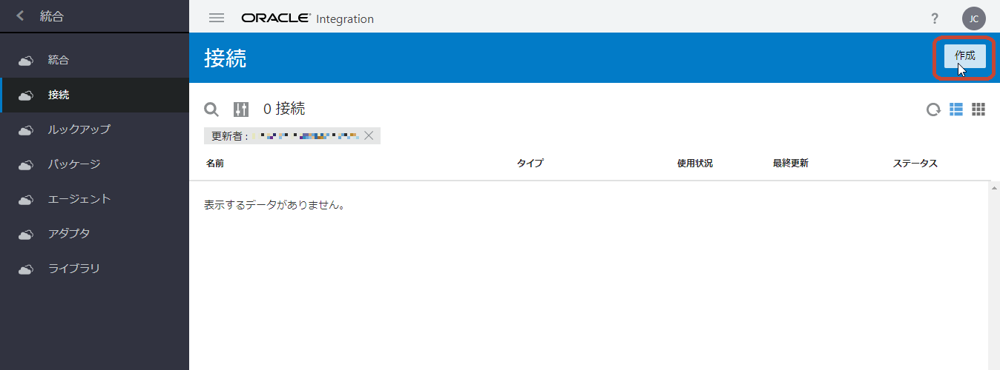
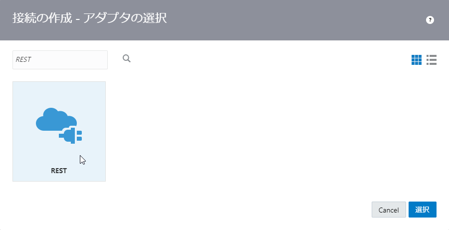
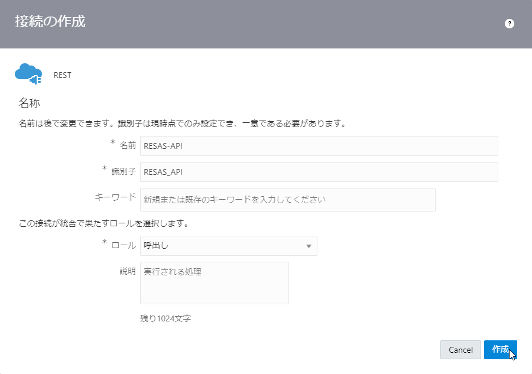
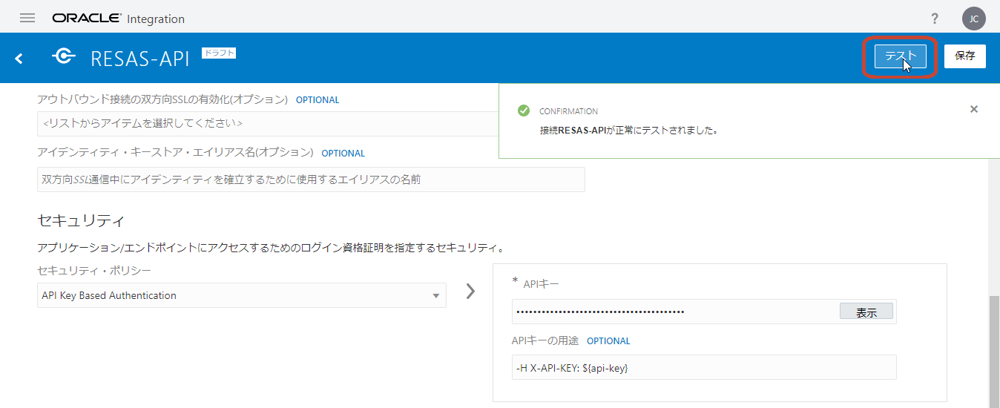
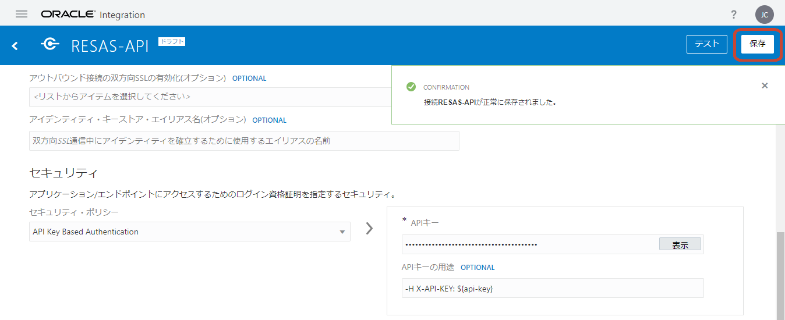
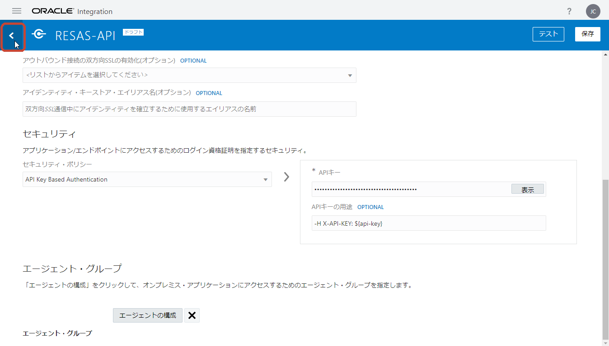

# RESAS-API 呼び出すための REST アダプタを使用した接続の作成

RESAS-API を呼び出すための REST アダプタ接続を作成する手順は次のとおりです。

1.  Oracle Integration Cloud の **「ようこそ」** または **「ホーム」** ページを開いている場合は、ナビゲーション・ペインで **「統合」** をクリックします。

    

    ナビゲーション・ペインに **「統合」** に関連するメニューが表示されます。
    **「接続」** をクリックします。

    

1.  Oracle Integration Cloud の **「接続」** ページが表示されたら、ページの右上にある **「作成」** ボタンをクリックします。

    

1.  **「接続の作成 - アダプタの選択」** ボックスが表示されます。

    

1.  **「検索」** フィールドに `REST` と入力して、表示を絞り込みます。
    表示された **「REST」** アイコンをクリックしてから右下の **「選択」** ボタンをクリックします。

    

1.  **「接続の作成」** ボックスが表示されます。
    作成する接続の基本情報を入力します。

    | 入力項目 | 入力する値 |
    |:----|:----|
    | **「名前」** | `RESAS-API` |
    | **「識別子」** | `RESAS-API` （「名前」を入力すると自動的に設定されます） |
    | **「ロール」** | **「呼び出し」** を選択 |

    

    入力したら右下の **「作成」** ボタンをクリックします。

1.  接続の詳細を入力するページが表示されます。
    **「接続プロパティ」** セクションでは、次のように値を入力します。

    | 入力項目 | 入力する値 |
    |:----|:----|
    | **「接続タイプ」** | **「REST APIベースURL」** を選択 |
    | **「TLSバージョン」** | 入力しない |
    | **「接続URL」** | `https://opendata.resas-portal.go.jp/api/v1` |

    

1.  **「セキュリティ」** セクションでは、次のように値を入力します。

    | 入力項目 | 入力する値 |
    |:----|:----|
    | **「セキュリティ・ポリシー」** | **「API Key Based Authentication」** を選択 |
    | **「APIキー」** | RESAS-API から発行された API キーを入力 |
    | **「APIキーの用途」** | `-H X-API-KEY: ${api-key}` |

    

1.  **「接続プロパティ」** と **「セキュリティ」** セクションの値を入力したら、ページの右上に表示されている **「テスト」** ボタンをクリックします。

    

    **「接続プロパティ」** で指定した値が正しければ、ページの右上に成功したことを表すメッセージ **「接続 <接続名> が正常にテストされました。」** が表示されます。

1.  テストに成功したら、ページの右上に表示されている **「保存」** ボタンをクリックします。

    

1.  保存できたら、ページの左上に表示されている **「<」** （戻る）アイコンをクリックして、 **「接続」** ページに戻ります。

    
